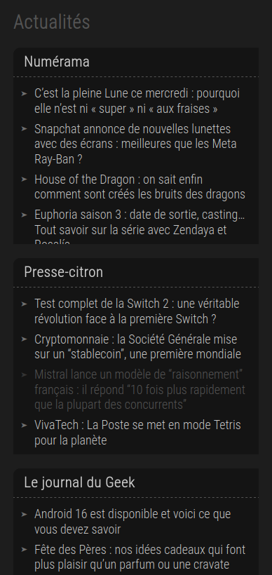
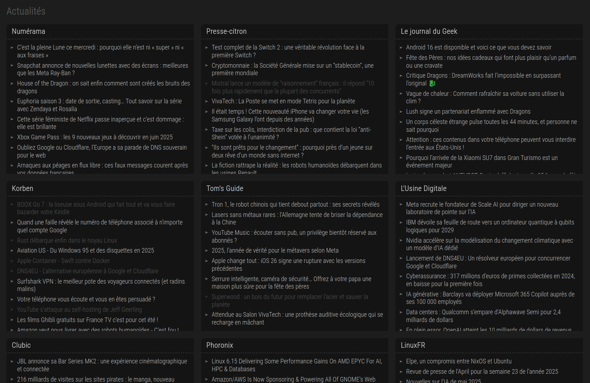

# RSS Reader

This project is my personal answer to RSS feed readers. I've tested many of them, but too many functions, too many bugs, too many slownesses pushed me to make my own. It doesn't do much, but it does exactly what I want it to do.

No database, no login, no registration, no ads, no tracking, no cookies. Just a php proxy to overcome CORS issues and a simple page to display the feeds.

And if it can help others, so much the better.

## Features

- Just 1 page
- Reload each feed every 1 hour
- Responsive

## Configuration

- Drop files on your server
- Modify the `sources.php` file to add your own feeds/categories.

## Screenshots

### Mobile

### Desktop

## License

This project is licensed under the MIT License.
